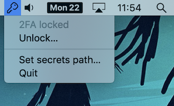
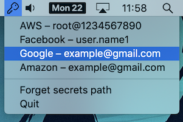
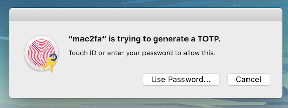

# mac2fa

Electron app for macOS which can read your [andOTP](https://github.com/andOTP/andOTP) backup file
and produce TOTP codes from the system tray.

  

#### Security warning

This app is a compromise between security and convenience. The secrets are encrypted
at rest in andOTP's **.json.aes** file format, and require a password to decrypt
when the app first starts. After that, they remain in plain text in the program's memory.
The app asks for Touch ID before generating any OTPs, but this can probably be bypassed
by a determined attacker because it doesn't actually store any secret in the secure enclave.

Having said that, it's still better than no 2FA at all.

### Develop

`npm install`

`npm run start` — compiles the TypeScript code and starts an Electron app

### Release

`npm run release` — builds and packages the app into a macOS .app bundle

---

##### Licensed under GPL v3
